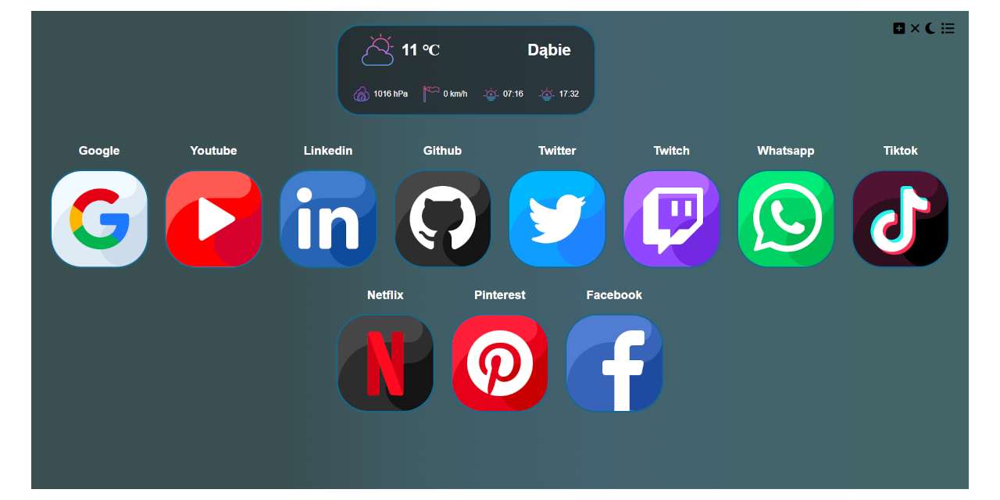

 

<h1>SpeedDial-Project</h1>
 
  
  

   
     
     
    <a href="https://violentrider.github.io/SpeedDial-Project/"><strong>Explore the website</strong></a>
     
    
  

<!-- ABOUT THE PROJEC -->
## About The Project

SpeedDial-Project is a website build on flexbox, using css styling and JavaScript functions. 
* Menu items are displayed dynamically using JavaScript methods.
* Plus button is used to create new speed dial item. Modal has a simple regexp object to check the webpage adress.
* To add your icon you should place it in the images folder and fill the url field in modal section with this pattern: "./images/yourIconName".
* X-mark button is used to delete the speedDial items.
* List button opens a ToDo box, where you can add your tasks to do. You can also edit and delete them.
* Website uses weather API from OpenWeather website to check the current weather for your location. Your current position is being downloaded using Geolocation API.
* Icons used in this project were downloaded from : <a href="https://www.flaticon.com/packs/social-media-163" title="google icons" class="thank-u-mr-babkin">Icon Pack: Social Media 
                | Flat created by Ruslan Babkin - Flaticon</a>

                

## Desktop view

## Mobile view
        
    

<!-- CONTACT -->
## Contact

Bartosz Bednarski - bartosz.bednarski97@gmail.com

Project Link: [https://github.com/ViolentRider/SpeedDial-Project](https://github.com/ViolentRider/SpeedDial-Project)

